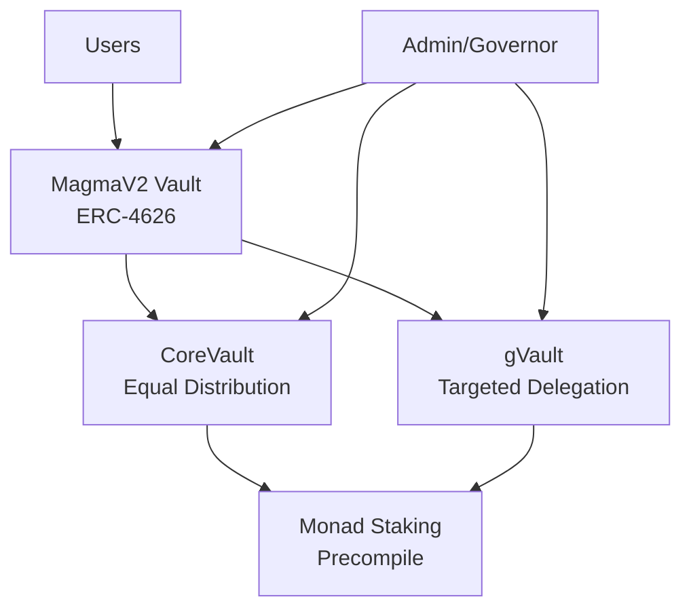

# MagmaV2 Protocol

[![Foundry][foundry-badge]][foundry]

[foundry]: https://getfoundry.sh/
[foundry-badge]: https://img.shields.io/badge/Built%20with-Foundry-FFDB1C.svg

## Overview

MagmaV2 is a liquid staking protocol built specifically for the Monad blockchain. It implements ERC-4626 with asynchronous withdrawal capabilities.

- **ERC-4626 Compliance**: Standard vault interface with extended async withdrawal support
- **UUPS Upgradeable**: Future-proof upgrade mechanism with admin controls
- **Dual Vault System**: CoreVault for equal distribution, gVault for targeted delegation

## Contracts

| Contract                               | Description                                                                                                                         | Mainnet Address |
| -------------------------------------- | ----------------------------------------------------------------------------------------------------------------------------------- | --------------- |
| [MagmaV2](src/MagmaV2.sol)                 | Main ERC-4626 vault with async withdrawal extensions (ERC-7540). User-facing interface for deposits, mints, and withdrawal requests | `TBD`           |
| [CoreVault](src/CoreVault.sol)         | Validator management vault for equal stake distribution across whitelisted validators                                               | `TBD`           |
| [gVault](src/gVault.sol)               | Targeted delegation vault with per-validator stake caps and curated validator sets                                                  | `TBD`           |
| [WrappedMonad](monad/WrappedMonad.sol) | ERC-20 wrapper for native MON tokens                                                                                                | `TBD`           |

### Architecture Overview



### Asset Flow

#### Deposits

1. **WMON Deposits**: `deposit()` → unwrap WMON → delegate native MON
2. **Native Deposits**: `depositMon()` → directly delegate native MON
3. **Immediate Delegation**: Assets are staked immediately through CoreVault

#### Withdrawals (Async)

1. **Request**: `requestRedeem()` → lock shares → queue undelegation
2. **Processing**: System batches requests when withdrawal IDs become available
3. **Claiming**: After delay period, `redeem()` → receive WMON or native MON

## Monad Integration

The protocol integrates with Monad's native staking through a precompile at `0x0000000000000000000000000000000000001000`.

## Getting Started

### Prerequisites

- [Foundry](https://getfoundry.sh/)
- [Node.js](https://nodejs.org/) (for package management)
- [Git](https://git-scm.com/)

### Installation

```bash
# Clone the repository
git clone https://github.com/your-org/magma-protocol
cd magma-protocol

# Install dependencies
forge install

# Install Node dependencies (if any)
npm install
```

### Building

```bash
# Compile contracts
forge build
```

### Testing

```bash
# Run all tests
forge test
```

## Acknowledgments

- [OpenZeppelin](https://openzeppelin.com/) for battle-tested contract libraries
- [Foundry](https://getfoundry.sh/) for the development toolkit
- [Monad](https://monad.xyz/) for the high-performance blockchain infrastructure

## Resources

- [Monad Documentation](https://docs.monad.xyz/)
- [Monad Staking Precompile](https://docs.monad.xyz/developer-essentials/staking/staking-precompile)
- [ERC-4626 Specification](https://eips.ethereum.org/EIPS/eip-4626)
- [ERC-7540 Async Redemptions](https://eips.ethereum.org/EIPS/eip-7540)

---
